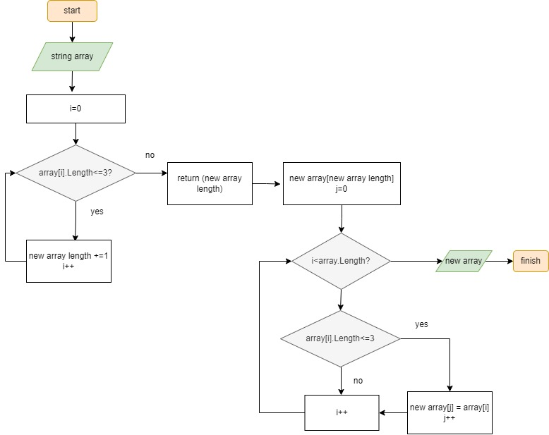

**Инструкция**
1. Запрашиваем у пользователя строковый массив
2. Считаем сколько внем нужных нам элементов с помощью цикла (метод)
3. Создаем новый строковый массив с длинной в полученную в пункте 2 величиной
4. Запускаем цикл который скопирует нужные элементы в новый массив (метод)

**Блок-схема**

